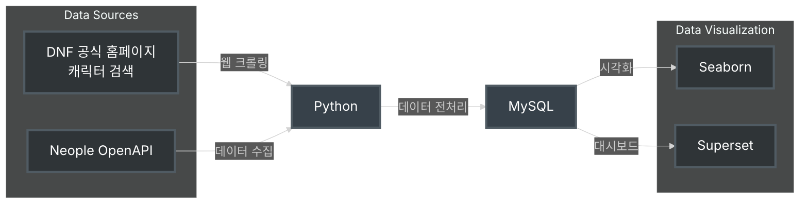

던전앤파이터 데이터 분석 프로젝트
===

## 프로젝트 개요
- 던전앤파이터 데이터를 수집하고 분석하여 인사이트를 도출합니다.

## 데이터 수집
1. **[던전앤파이터 공식 홈페이지](https://df.nexon.com/)**:
   - 웹 크롤링을 통해 데이터를 수집합니다.
2. **[네오플 Open API](https://developers.neople.co.kr/)**:
   - [[Open API 목록]](https://developers.neople.co.kr/contents/apiDocs/df)를 사용하여 데이터를 수집합니다.





## 파일 구조
```text
project
│
├─ configs : 프로젝트 설정.
│ 
├─ data : 데이터 파일 저장.
│    └─ raw 
│    └─ processed
│
├─ docs : 프로젝트 문서 및 참고 자료.
│
├─ notebooks : 분석 결과 및 레포트 Jupyter Notebook 파일.
│   └─ project1 : 던전앤파이터 활동 데이터 기반 고객 세분화 및 타겟팅 전략
│
├─ sql : 프로젝트 DB 세팅 및 쿼리.
│
├─ scripts : 데이터 크롤링, 수집, 자동화, 분석을 수행하는 스크립트.
│
├─ src : 프로젝트 주요 소스 코드.
│
└─ utils : 유틸리티 함수 및 모듈.
```